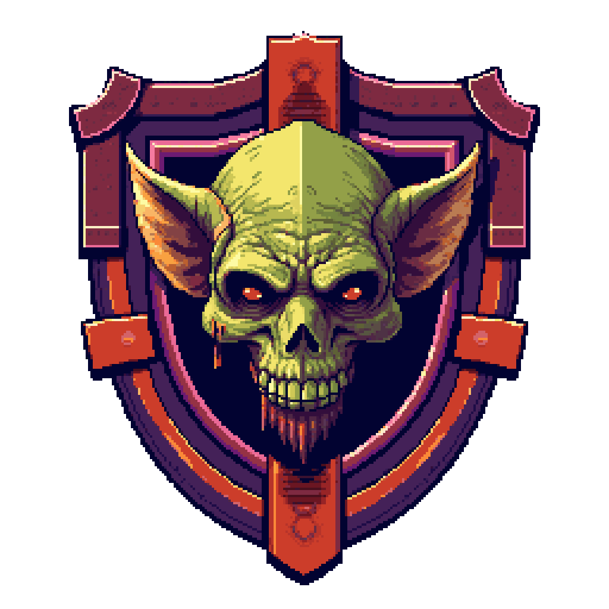

<!-- Improved compatibility of retour en haut link: See: https://github.com/othneildrew/Best-README-Template/pull/73 -->
<a id="readme-top"></a>
<!--
*** Thanks for checking out the Best-README-Template. If you have a suggestion
*** that would make this better, please fork the repo and create a pull request
*** or simply open an issue with the tag "enhancement".
*** Don't forget to give the project a star!
*** Thanks again! Now go create something AMAZING! :D
-->


<!-- PROJECT SHIELDS -->
<!--
*** I'm using markdown "reference style" links for readability.
*** Reference links are enclosed in brackets [ ] instead of parentheses ( ).
*** See the bottom of this document for the declaration of the reference variables
*** for contributors-url, forks-url, etc. This is an optional, concise syntax you may use.
*** https://www.markdownguide.org/basic-syntax/#reference-style-links
-->

<!-- PROJECT LOGO -->
<br />
<div align="center">
  <a href="https://gibson.telecomnancy.univ-lorraine.fr/projets/2425/ppii-fisa/grp1/">
    
  </a>

<h3 align="center">Goby Roads - UI</h3>
  <p align="center">
    Aider Goby, notre goblin, à retourner dans son monde. 
    <br />
    Goby Roads - UI est la surcouche graphique de notre jeu. Elle reprend la version core directement depuis son répertoire et l'encapsule pour offrir un jeu aussi fidèle que possible à notre version initiale.
    <br />
    <br />
    <a href="../docs/Documentation PP2I.pdf"><strong>Explorer la doc »</strong></a>
    <br />
  </p>
</div>


<!-- TABLE OF CONTENTS -->
<details>
  <summary>Table des matières</summary>
  <ol>
    <li>
      <a href="#à-propos-du-projet">À propos du projet</a>
      <ul>
        <li><a href="#codé-avec">Codé avec</a></li>
      </ul>
    </li>
    <li>
      <a href="#pour-commencer">Pour commencer</a>
      <ul>
        <li><a href="#prérequis">Prérequis</a></li>
        <li><a href="#installation">Installation</a></li>
      </ul>
    </li>
    <li><a href="#utilisation">Utilisation</a></li>
    <!-- <li><a href="#roadmap">Roadmap</a></li> -->
    <!-- <li><a href="#contributing">Contributing</a></li> -->
    <!-- <li><a href="#license">License</a></li> -->
    <!-- <li><a href="#contact">Contact</a></li> -->
    <li><a href="#remerciements">Remerciements</a></li>
  </ol>
</details>


<!-- ABOUT THE PROJECT -->
## À propos du projet

<div align="center">
    
</div>

Après avoir réalisé la version *Core* du jeu, nous nous sommes concentré sur la version *UI*. Celle-ci utilise des technologies auquel nous n'étions pas du tout familier. De ce fait, elle s'est avérée très formatrice. Par ailleurs, elle a aussi grandement amélioré nos compétences en C et en *"Structure de données"*.

<!-- Here's a blank template to get started. To avoid retyping too much info, do a search and replace with your text editor for the following: `github_username`, `repo_name`, `twitter_handle`, `linkedin_username`, `email_client`, `email`, `Goby Roads - Core (CLI)`, `project_description`, `project_license` -->

<p align="right">(<a href="#readme-top">retour en haut</a>)</p>


### Codé avec

* [![C][C]][C-url]
* [![SDL][SDL]][SDL-url]
* [![SDLTTF][SDLTTF]][SDLTTF-url]
* [![SDLIMAGE][SDLIMAGE]][SDLIMAGE-url]
* [![SDLMIXER][SDLMIXER]][SDLMIXER-url]

<p align="right">(<a href="#readme-top">retour en haut</a>)</p>


<!-- GETTING STARTED -->
## Getting Started

Pour avoir une version fonctionnelle de notre jeu édition *UI*, veuillez suivre les instructions suivantes.

### Prérequis

Cette version du jeu nécéssite SDL2, SDL2_TTF, SDL2_Mixer et SDL2_Image, les versions utilisées figurent dans la section précédente.
- Les fichiers **"*.dll"** doivent être installés dans le dossier **"ui/bin"**.
- Les fichiers **"*.h"** doivent être installés dans le dossier **"ui/include/SDL2"**
- Les fichiers de librairies présents dans le dossier **"lib"** des packages SDL doivent être installés dans le dossier **"ui/lib"**, ainsi que les sous dossiers **"cmake"** et **"pkgconfig"**. Les fichiers ont pour extensions soit : **"*.pc"**, **"*.cmake"**, **"*.a"**, **"*.la"** ou encore **"*.dll.a"**.

### Installation

1. Cloner le répertoire
   ```sh
   git clone https://gibson.telecomnancy.univ-lorraine.fr/projets/2425/ppii-fisa/grp1.git
   ```
2. Se placer dans la version *UI* du jeu
   ```sh
   cd grp1/ui
   ```
3. S'assurer que SDL2, SDL2_Mixer, SDL2_TTF et SDL2_Image soient installés et aux bons endroits comme indiqué dans les <a href="#prérequis">prérequis</a>.

3. Lancer le jeu grâce au Makefile 
   ```sh
   make run
   ```

<p align="right">(<a href="#readme-top">retour en haut</a>)</p>

<!-- USAGE EXAMPLES -->
## Utilisation

Le jeu se joue à la fois avec les touches ZQSD et les touches fléchées. La touche F permet de quitter le jeu tandis que la touche M permet d'activer/désactiver la musique de fond.

_Pour plus d'informations sur le code, référez-vous à la [Documentation](https://example.com)._

<p align="right">(<a href="#readme-top">retour en haut</a>)</p>


<!-- CONTACT
## Contact

Your Name - [@twitter_handle](https://twitter.com/twitter_handle) - email@email_client.com

Project Link: [https://github.com/github_username/repo_name](https://github.com/github_username/repo_name)

<p align="right">(<a href="#readme-top">retour en haut</a>)</p>
 -->


## Remerciements

* [Arbres et éléments naturels - CraftPix](https://craftpix.net/)
* [Effets sonores et musiques - Pixabay](https://pixabay.com)
* [Icône Warning Pixel Art - Vecteezy](https://www.vecteezy.com/vector-art/6470594-caution-pixel-art-business-icon)
* [Retro Pixel Font par TakWolf](https://github.com/TakWolf/retro-pixel-font)
* [Public Pixel Font par GGBotNet](https://ggbot.itch.io/public-pixel-font)
* [Sprites de voitures - minzinn](https://minzinn.itch.io/)
* [Sprites de trains - reakain](https://reakain.itch.io/gb-studio-trains)
* [Sprites du Goblin et logos du jeu - RetroDiffusion](https://www.retrodiffusion.ai/)


<!-- MARKDOWN LINKS & IMAGES -->
<!-- https://www.markdownguide.org/basic-syntax/#reference-style-links -->
[product-screenshot]: ../logo2.png
[C]: https://img.shields.io/badge/c-%2300599C.svg?style=for-the-badge&logo=c&logoColor=white
[C-url]: https://www.gnu.org/software/gnu-c-manual/
[SDL-url]: https://github.com/libsdl-org/SDL
[SDLTTF-url]: https://github.com/libsdl-org/SDL_ttf
[SDLMIXER-url]: https://github.com/libsdl-org/SDL_mixer
[SDLIMAGE-url]: https://github.com/libsdl-org/SDL_image
[SDL]: https://img.shields.io/badge/SDL-2.30.12-blue.svg?style=for-the-badge
[SDLTTF]: https://img.shields.io/badge/SDL_ttf-2.24.0-blue.svg?style=for-the-badge
[SDLIMAGE]: https://img.shields.io/badge/SDL_image-2.8.8-blue.svg?style=for-the-badge
[SDLMIXER]:https://img.shields.io/badge/SDL_mixer-2.8.1-blue.svg?style=for-the-badge